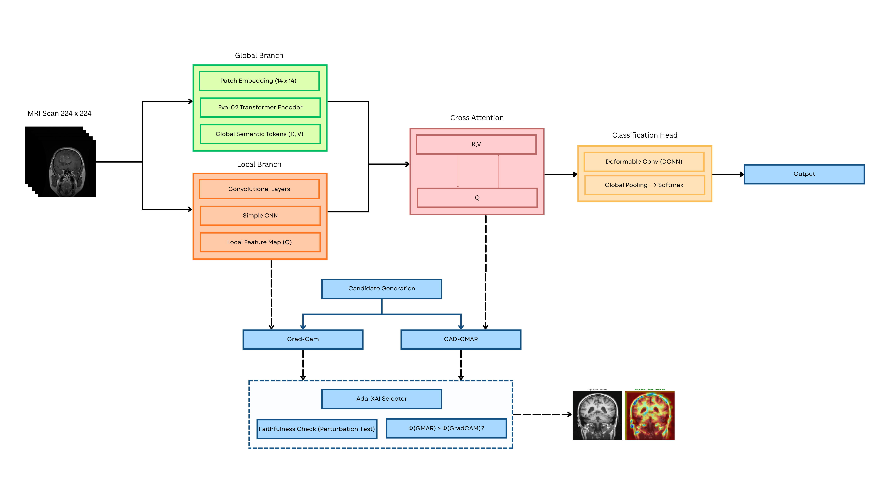

# ADA-XAI: Adaptive Faithfulness-Driven Explainability for Brain Tumor MRI Classification

<p align="center">
  
</p>

<p align="center">
  <b>Adaptive Explainable AI Framework for Brain Tumor Diagnosis using Hybrid EVA-02 Transformers and Deformable CNNs</b>
</p>

<p align="center">
  
  
  
  
  
</p>

---

## Overview

ADA-XAI is a hybrid Explainable AI framework designed for **brain tumor classification from MRI scans** using a combination of:

* **EVA-02 Vision Transformers**
* **Deformable CNNs (DCNN)**
* **Cross Attention Fusion**
* **Adaptive Explainability Mechanism**

Unlike conventional CNN-only or Transformer-only systems, ADA-XAI dynamically combines:

* **Global semantic understanding** from EVA-02
* **Local irregular tumor morphology extraction** from DCNN

The framework also introduces an **Adaptive XAI mechanism** that intelligently selects between:

* **Grad-CAM**
* **CAD-GMAR (Cross Attention Gradient-Driven Multi-Head Attention Rollout)**

based on real-time faithfulness evaluation.

The proposed model achieved **99% accuracy** on the Kaggle Brain Tumor MRI dataset. 

---

# Published Research Paper

**Ada-XAI: Adaptive Faithfulness-Driven Explainability for Hybrid Eva-02 and Deformable CNNs in Brain Tumor Diagnosis From MRI Images** 

Published at:

**2026 International Conference on Innovative Trends in Information Technology (ICITIIT)**

DOI:
[https://doi.org/10.1109/ICITIIT68860.2026.11499683](https://doi.org/10.1109/ICITIIT68860.2026.11499683)

---

# Architecture

<p align="center">
  
</p>

The framework consists of:

## 1. EVA-02 Global Context Branch

* Vision Transformer pretrained using Masked Image Modeling
* Captures:

  * Long-range dependencies
  * Global anatomical structure
  * Semantic context

## 2. Deformable CNN Local Branch

* Uses deformable convolutions
* Learns:

  * Irregular tumor boundaries
  * Local texture patterns
  * Shape-adaptive receptive fields

## 3. Cross Attention Fusion

The model fuses CNN and Transformer features using a Query-Key-Value attention mechanism:

* Query → CNN features
* Key & Value → EVA-02 features

This enables:

* Local feature enhancement using global context
* Better localization
* Robust semantic understanding

## 4. Adaptive Explainability (ADA-XAI)

The system dynamically chooses the best XAI method using a faithfulness-driven selection mechanism.

### Selected Methods

* Grad-CAM
* CAD-GMAR

### Selection Criteria

* Perturbation AUC
* Confidence drop analysis
* Dominance evaluation between Transformer and CNN branches

---

# Features

* Hybrid Transformer + CNN architecture
* Adaptive explainability
* Faithfulness-driven XAI selection
* MRI tumor classification
* Robust against noisy MRI inputs
* Transfer learning pipeline
* Research-oriented modular design
* High interpretability for medical AI

---

# Results

| Model                  | Accuracy |
| ---------------------- | -------- |
| KNN                    | 82%      |
| SVM                    | 88%      |
| CNN                    | 96.03%   |
| ViT                    | 98.86%   |
| **ADA-XAI (Proposed)** | **99%**  |

The framework demonstrated:

* Improved explainability fidelity
* Better localization performance
* Higher robustness to MRI noise perturbations


---

# Adaptive XAI Workflow

The framework generates:

* `Mcnn` using Grad-CAM
* `Mvit` using CAD-GMAR

A faithfulness metric evaluates both explanations in real time and selects the optimal explanation map. 

---

# Dataset

The framework uses:

## Kaggle Brain Tumor MRI Dataset

* 7023 MRI images
* 4 classes:

  * Glioma
  * Meningioma
  * Pituitary
  * No Tumor

## Figshare Brain Tumor Dataset

* 3064 MRI samples
* Transfer learning pretraining stage

---

# Explainability Output

The system automatically selects:

* Grad-CAM when CNN dominates
* CAD-GMAR when Transformer dominates

This enables:

* More faithful explanations
* Improved stability
* Better clinical trustworthiness

---

# Research Contributions

## Proposed Contributions

* Adaptive faithfulness-driven XAI
* Hybrid EVA-02 + DCNN fusion
* Cross-attention-based feature integration
* Transformer-aware explainability
* Robust MRI classification pipeline

---

# Citation

```bibtex
@INPROCEEDINGS{11499683,
  author={Sreehari R and Abhinav R and Kalidas V.S and Neeraj Sukumaran and Rajeev Rajan and Chinchu M S},
  booktitle={2026 International Conference on Innovative Trends in Information Technology (ICITIIT)},
  title={Ada-XAI: Adaptive Faithfulness-Driven Explainability for Hybrid Eva-02 and Deformable CNNs in Brain Tumor Diagnosis From MRI Images},
  year={2026},
  doi={10.1109/ICITIIT68860.2026.11499683}
}
```

---

# Future Work

* Clinical-grade evaluation
* Multi-modal MRI support
* Real-time deployment
* Federated medical AI
* 3D MRI explainability
* Explainable segmentation framework

---

# Author
* Sreehari R
# Co-Author
* Abhinav R
* Kalidas V.S
* Neeraj Sukumaran
* Rajeev Rajan
* Chinchu M S

---

# License

This project is licensed under the MIT License.

---

# Acknowledgements
* ICITIIT 2026
* Kaggle Brain Tumor Dataset
* Figshare Brain Tumor Dataset

---

# Repository

[ADA-XAI-MRI Repository](https://github.com/Sree14hari/ADA-XAI-MRI.git?utm_source=chatgpt.com)
